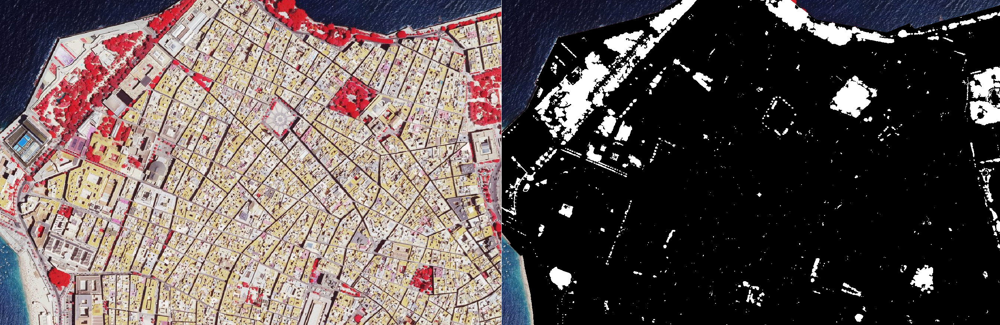

# Análisis de cobertura vegetal en los municipios de Cádiz mediante imágenes satelitales

<h3> ¿Cuanta vegetación se encuentra dentro de cada municipio de Cádiz? </h3>

Este proyecto intenta mediante el estudio de las imágenes satelitales dar luz a la pregunta: ¿Cual es el municipio de Cádiz más verde?

Algunos municipios cuentan con un límite administrativo bastante grande en comparación con el núcleo urbano que tiene, pero esto no exime de la posibilidad de alojar zonas verdes como parques o plazas en municipios con un área administrativa más pequeña que otros.

# Tecnologías

* **Lenguajes y librerías**: Python (`NumPy`, `geopandas`, `Rasterio` y `OpenCV`) para el procesamiento de imágenes

* **Análisis Geoespacial**: QGIS para visualización y validación

* **Fuentes de datos**: Ortofotos PNOA (CNIG) y límites administrativos de OpenStreetMap

# Metodología

Las imágenes satelitales (0.25m x 0.25m por píxel) han sido binarizadas siguiendo 3 condiciones para contabilizar un píxel de la imagen como '**Vegetacion**':

* **Normalized Difference Vegetation Index**: el coeficiente **NDVI** debe superar un umbral de **0.35**. Siendo calculado usando los valores de las bandas **NIR** y **Roja** de la siguiente forma:

$$NDVI = \dfrac{NIR - Roja}{NIR + Roja}$$

* **Umbral de brillo**: el brillo de las bandas **NIR** y **Roja** deben superar un umbral de **40** para descartar posibles sombras o aguas oscuras

* **Intensidad de reflectancia**: la intensidad de la banda **NIR** debe superar un valor de **100** para confirmar una masa vegetal

En caso de un píxel superar de manera simultánea estas 3 condiciones sería considerado como '**Vegetacion**'

# Resultados

Los resultados (ranking y mapa interactivo) pueden encontrarse en la web del proyecto: [naim-prog.github.io/green-city-cadiz](https://naim-prog.github.io/green-city-cadiz)

Comparativa del antes y despues del tratamiento de la imagen en la zona Norte del municipio de Cádiz. Se puede observar que zonas como el Parque Genovés aparecen como una gran masa de vegetación, así como varias plazas (San Antonio y Mina) destacan tambien por su gran presencia en cuanto a masa vegetal.



# Reproducibilidad

Si tienes el gestor de paquetes de Python `uv` utiliza el comando:

```
uv sync
```

Si tienes el gestor de Python `pip` utiliza el comando:

```
pip install -r requirements.txt
```

Para descargar las imágenes satelitales ejecuta el script de Python `cnig-donwloader.py` con el siguiente comando:

```
python cnig-downloader.py
```

Para descargar la comunidad de Andalucía de OSM para los límites municipales crea el directorio osm/ y descarga [el archivo](https://download.geofabrik.de/europe/spain/andalucia-latest.osm.pbf) de Geofabrik

Luego deberás seguir las instrucciones de cada uno de los apartados de la jupyter notebook `script.ipynb` y ejecutar los que sean necesarios.

# Fuentes

* Imágenes satelitales propiedad del [CNIG](https://centrodedescargas.cnig.es/CentroDescargas/ortofoto-pnoa-falso-color-infrarrojo) (_Centro Nacional de Información Geográfica_)
* Datos geoespaciales propiedad de [OpenStreetMap](https://www.openstreetmap.org/) y procesados por [Geofabrik Gmbh](https://www.geofabrik.de)
